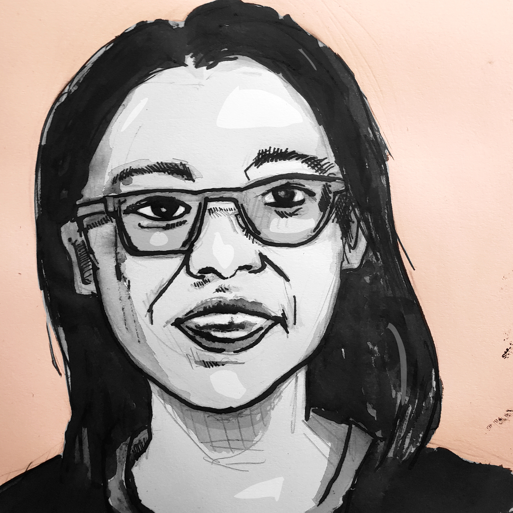

Novel NFTs
===

# Crypto Drift: Novel NFTs

Crypto Drift is a replicable experiment in the performance and gamification of novel writing. It is an "occasional" text, written for the virtual "buildathon" for the EthDenver conference in February and March of 2022. It also borrows heavily from the idea of "hex flower" procedurally generated novels, developed by [Goblin's Henchman](https://goblinshenchman.wordpress.com/).

# Roadmap

* March 3rd: Part one Published (7 chapters) on Spindle. NFTs of characters up on storefront.
* March 10th: Part two Published (~7 chapters). Abstract art and instrumental music released on Crescendo
* March 17th: Part three Published (~7 chapters). Possible buy-backs of NFTs for original value in Algo/Yarn, from project wallet.

# Hex Flowers

The highest scoring NFT will get the spot, or direction on the hexagonal compass, most likely to be rolled. There is a major trend downward, and a minor trend down and to the left.

Another roll will determine the secondary character in the scene, according to the table.

# The Novel
The narrative is set in a fictionalized version of the conference itself, with an ensemble cast of characters.

Having much of the conference broadcast virtually creates an opportunity for a shared fictional setting, a powerful point of reference, but the names and identities of actual people, technologies, and blockchains have been changed.

# The NFTs
While the exact deployment of the Crypto Drift collection of NFTs may change, the current plan is to release unique NFTs for six or more main characters. Each of these character NFTs will have a sale price based on the number of words written about them[^1].

If the owner of the NFT is able to resell for a higher value, more of the novel will be devoted to that character and their story. There are two possibilities here:
1. The words for that character's chapters are based directly on the value of the NFT in Algos or dollars, or
2. The total number of words is capped at 60,000, and the focus on different characters is based on the proportion of their NFT(s) to the total.

Additional NFTs will be created for possible endings, with the highest value determining the events of the narrative.
## Derivative NFTs
Possible implementation: the NFTs for the characters are released under a creative commons 4.0 non-commercial share-alike license, but ownership of the NFT grants the right to make derivative works for commercial purposes. This means an artist or fan could mint additional NFTs based on the original, and the point total for the character or plot twist would be the sum of existing NFTs, not just that issued by the original creator.
# Organizational Support
[Raid Guild](https://raidguild.org), and specifically the season 4 cohort, have been instrumental in the ideation phase of this project. Additionally, the [Spindle ASA](https://www.reddit.com/r/SpindleASA/)community continues to provide invaluable early feedback and support.
# Algorand
In the novel, Algorand is loosely depicted as **Goalrand**. In reality, Algorand is my first choice for implementation of this NFT project because my familiarity with the blockchain, existing connections to the ecosystem, and speed and ease-of-use.

# Bounties
Algorand has offered $25,000 in [bounties](https://www.ethdenver.com/bounties/algorand)for web3 solutions using their virtual machine. In order to qualify for the bounty, this project would need back-end and smart contract functionality beyond my skills as a developer. I would also need at least one other team member to list on the [application](hackerlink.io).

# Team
Please get in touch if you want to help with front end, smart contracts, or the creation of the NFTs.

# Creator Wallet
The wallet for this project is: xxxx, created February 12, 2022. At the end of the build-a-thon, March 21, the wallet will be empty. Any funds sent to the creator wallet over the course of the build will be used to comission services related to the project.

Funds sent to the wallet can have a note attached indicating what you would like to see in the novel, but there are no guarantees the idea will be included, at any price.
Whether there will be royalties from the NFTs in the future is undecided.

This document will be updated to include any funds and notes received, as well as work comissioned from any profits.

# Why this setting?
For one, incorporating events from the conference as it happens will serve as proof that the novel was written after the events occured. For another, it demonstrates the active, participatory philsophy of Novel NFTs. Stories can be a way to build community and develop ideas, to speculate about projects that *could* have happened, and things that *might* have been said.

I'm not at the conference in person, but these characters can be. Virtual castles are well and good, but imagination can also be an effective form of tele-presence.

# Memetics
My contribution is at the level of pseudo-code, of theory and narrative. The memes this project introduces can be replicated in any crypto ecosystem, by anyone brave or foolish enough to try.
# Rug Pull
This NFT project is avowedly a rug pull, in that I make no promises of maintenance, growth, or marketing of the collection or novel once the buildathon is over.

# Ideas
Feel free to contact me if you have an idea for the novel, or the project, or would like to contribute.

[^1]: As determined by the word count for chapters where they are the Point of View (POV) character.

###### tags: `writing` `NFTs` `novel` `algorand` `ethdenver`
