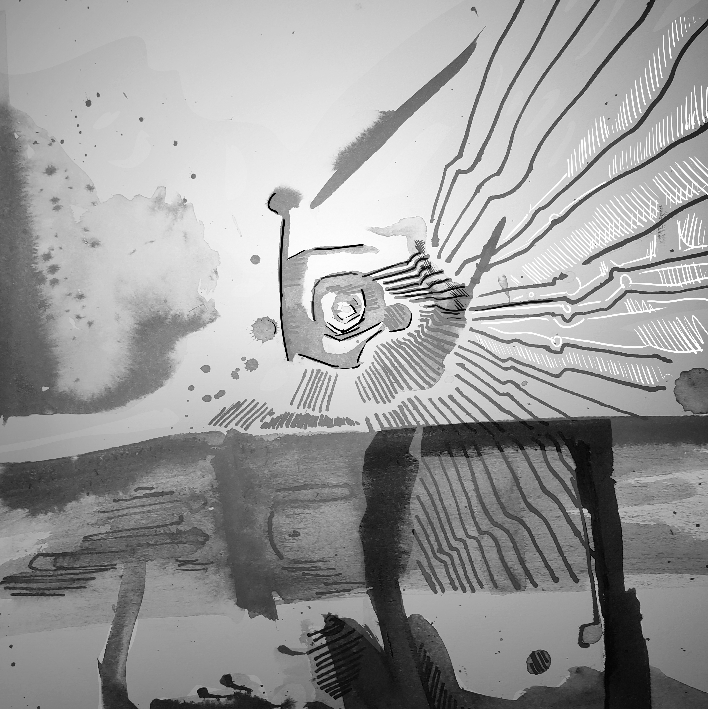

# Conclusion

Which characters appeared in chapters 8-17 were determined by random die rolls on a hex-flower table.

The votes for the ending and genre of the novel were divided between an Ecological Comedy, with an optimistic view of the web 3 space, and Supernatural Comedy, with elements of Science Fiction and Fantasy.

Working on this project has certainly made me, personally, optimistic about the potential of blockchain technology to gamify and monetize fiction. I am grateful to the Spindle team that developed the front and back end of the site, without which this work would be immeasurably less readable and enjoyable.
